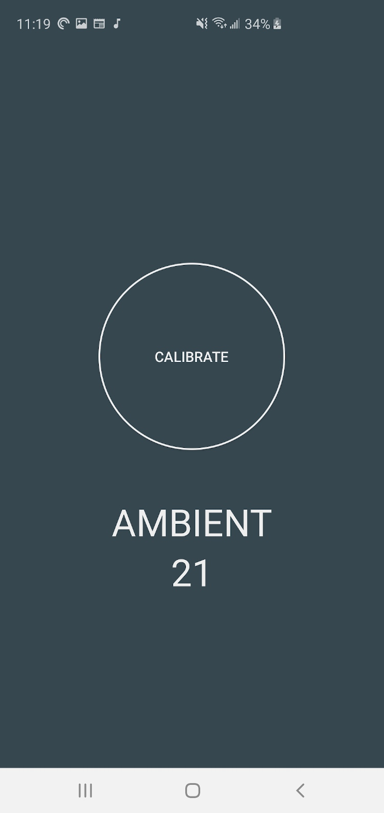

# SNORE
Determining if you have sleep apnea and even if you snore at night can be a complicated and intrusive process. This app is designed to mitigate that problem. When used with our custom wireless wearable sensor you can determine if you snore or potentially have sleep apnea in the comfort of your own home. This app also allows you to save your sleep records and revisit them for personal analysis or to show to a medical professional for further diagnosis. For more information check out our [Senior Design Report](Final_Report.docx)!

# Screenshots
## Splash Screen

## Home Page

## Bluetooth Scan Page

## Sensor Calibration Page

## Sleep Start Page

## Results Page

## Home Page with Data
